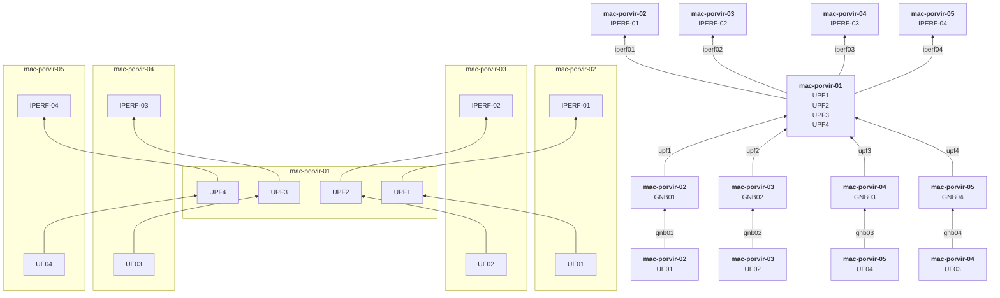

# Experimentos

## Diagrama de rede

## Experimento 01 - Baseline

Este experimento é composto por 4 slices, um UPF para cada slice, sendo que todos na mesma máquina.  

- São 4 slices na mesma máquina.
- Rodando script que aumenta a cada 5 minutos o número de UEs para cada slice (2,3,4) na seguinte quantidade:
  -  {1,5,10,15,20,25,30}
- Todos slices sem restrição de recursos
- Após chegar a 30 UEs é reduzido a banda de UPF4 a cada 5 min
  - {100, 75, 50, 25, 10, 5, 1}

### Slices

- **Slice 1** não aumenta o número de UEs, fica fixo em um único UE. Recebnedo UDP de 32Mbps. Usando IPERF.
- **Slice 2** Recebendo UDP de 3Mbps. Usando IPERF.
- **Slice 3** Enviando mensagens MQTT a cada 1 segundo. Usando Mosquitto
- **Slice 4** Transmite dados TCP. Usando IPERF.

### Conclusões

###  Links: 
- [Snapshot raintank](https://snapshots.raintank.io/dashboard/snapshot/6D7ZVa1knxh0uAnkTCJr7puoE4ETT6tS)
- [Snapshot local](http://localhost:3000/dashboard/snapshot/r4OTaQXUt0F2h0YiSDWkv5Oyz5lmKQTX)
- [GitHub - Tag vE01](https://github.com/maikovisky/open5gs/tree/vE01)

## Experimento 02 - Limitando recursos

- Mesmo script do experimento 01, mas com limitação de recursos
  - **UPF-1**
    - **Requests**: CPU 1250m, MEM: 250m
    - **Limits**: CPU 1250m, MEM: 250m
  - **UPF-2**
    - **Requests**: CPU 1200m, MEM: 250m
    - **Limits**: CPU 1200m, MEM: 250m
  - **UPF-3**
    - **Requests**: CPU 1200m, MEM: 250m
    - **Limits**: CPU 1200m, MEM: 250m
  - **UPF-4**
    - **Requests**: not defined
    - **Limits**: not defined

### Conclusões

### Links:
- [Snapshot raintank](https://snapshots.raintank.io/dashboard/snapshot/0NB01YiXKN5ucm71tFOdiI9pLLmrPI1C)
- [Snapshot local](http://localhost:3000/dashboard/snapshot/J1H7PIhXANeCujItO6XqTuexcxohXoy6)