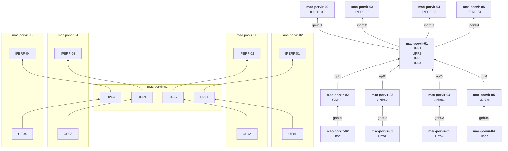

# Cenário

O cenário imagino nesses experimentos é simular um transmissão de vídeo na qual o médico esteja operando a distância, para isso será necessário que o vídeo não tenha latência e tenha alta qualidade. Esse vídeo irá utilizar um slice específico para essa transmissão de vídeo (slice 1). O segundo slice foi imaginado diversos médicos e alunos assistindo a operação, o vídeo nesse caso não necessita muita qualidade e nem baixa latência. O terceiro slice será utilizado para a transmissão de mensagens de IoT de monitoramentos diversos. O quarto slice seria a simulação de um trafego de dados normal.

**anotações**: será que adicionar mais um slice para simular o uso de instrumentos remotamente (necessidade de baixa latencia)? Ou adicionar no mesmo slice 1 o tráfego de dados dos instrumentos. Ou o médico estará apenas orientando outro médico. 

# Experimentos

Os experimento iniciam com 1 UE para cada slice e vão subindo a cada 5 minutos o número de UEs em cada slice. 

| **Experience** |       **UPF1**      |       **UPF2**      |       **UPF3**      |       **UPF4**      |        **Obs**        |
|:--------------:|:-------------------:|:-------------------:|:-------------------:|:-------------------:|:---------------------:|
|     **01**     |   CPU: nd MEM: nd   |   CPU: nd MEM: nd   |   CPU: nd MEM: nd   |   CPU: nd MEM: nd   | Limintando banda UPF4 |
|     **02**     | CPU: 1250 MEM: 250  | CPU: 1200 MEM: 250  | CPU: 1200 MEM: 250  |   CPU: nd MEM: nd   | Limintando banda UPF4 |
|     **03**     | CPU: 1250 MEM: 250  |   CPU: nd MEM: nd   | CPU: 1250 MEM: 250  | CPU: 1250 MEM: 250  | Limintando banda UPF4 |
|                |                     |                     |                     |                     |                       |

## Diagrama de rede

## Experimento 01 - Baseline

Este experimento é composto por 4 slices, um UPF para cada slice, sendo que todos na mesma máquina. Somente o Slice 01 terá tráfego

### Slices

- **Slice 1** São 4 UEs. Enviando UDP de 32Mbps. Usando IPERF.
- **Slice 2** Recebendo UDP de 3Mbps. Usando IPERF.
- **Slice 3** Enviando mensagens MQTT a cada 1 segundo. Usando Mosquitto
- **Slice 4** Transmite dados TCP. Usando IPERF.

### Conclusões

###  Links: 
- [Snapshot raintank](https://snapshots.raintank.io/dashboard/snapshot/x2COS8O2RvA5NJ6SXhiQRpHg6RINfIDu)
- [Snapshot local](http://localhost:3000/dashboard/snapshot/VOdXmuVvS29a7YArTccH8rjiGOF0JiOh)
- [Grafana](http://localhost:3000/goto/quxRbm5Ik?orgId=1)
- [GitHub - Tag vE01](https://github.com/maikovisky/open5gs/tree/vE01)

## Experimento 02 - Concorrento com um segundo Slice sem Limitações

- Mesmo script do experimento 01, mas com limitação de recursos
  - **UPF-1**
    - **Requests**: not defined
    - **Limits**: not defined
  - **UPF-2**
    - **Requests**: not defined
    - **Limits**: not defined
  - **UPF-3**
    - **Requests**: not defined
    - **Limits**: not defined
  - **UPF-4**
    - **Requests**: not defined
    - **Limits**: not defined

###  Links: 
- [Snapshot raintank](https://snapshots.raintank.io/dashboard/snapshot/cVPGG1HBfu7qPBtT2TUx9eob5ETnKjTQ)
- [Snapshot local](http://localhost:3000/dashboard/snapshot/zxDVxqVEpn4sO5b4lAhUrfGRvlqfQnDv)
- [Grafana](http://localhost:3000/goto/Ga95xmcIk?orgId=1)

## Experimento 03 - Concorrento com todos os Slice sem Limitações

- Mesmo script do experimento 01, mas com limitação de recursos
  - **UPF-1**
    - **Requests**: not defined
    - **Limits**: not defined
  - **UPF-2**
    - **Requests**: not defined
    - **Limits**: not defined
  - **UPF-3**
    - **Requests**: not defined
    - **Limits**: not defined
  - **UPF-4**
    - **Requests**: not defined
    - **Limits**: not defined

###  Links: 
- [Snapshot raintank](https://snapshots.raintank.io/dashboard/snapshot/8apEZomqsDsAoZ0Y1NjhW8np8GmykeDe)
- [Snapshot local](http://localhost:3000/dashboard/snapshot/HqbCaHKpfI3odBCqleaSk622AxODb9Xa)
- [Grafana](http://localhost:3000/goto/8nOLPp5Sz?orgId=1)

## Experimento 04 - Recurso limitado para Slice 1

- Mesmo script do experimento 01, mas com limitação de recursos
  - **UPF-1**
    - **Requests**: CPU 1000m
    - **Limits**: CPU 1000m
  - **UPF-2**
    - **Requests**: not defined
    - **Limits**: not defined
  - **UPF-3**
    - **Requests**: not defined
    - **Limits**: not defined
  - **UPF-4**
    - **Requests**: not defined
    - **Limits**: not defined

###  Links: 
- [Snapshot raintank](https://snapshots.raintank.io/dashboard/snapshot/KiRyVm66qLZlq7hZ82L3i6VblP7A9wba)
- [Snapshot local](http://localhost:3000/dashboard/snapshot/Xy9kqiGB2vam6TYmf3YZIA7QdCmzEIBx)
- [Grafana](http://localhost:3000/goto/9GdVspcIz?orgId=1)

## Experimento 05 - Todos com recurso de CPU limitado

- Mesmo script do experimento 01, mas com limitação de recursos
  - **UPF-1**
    - **Requests**: CPU 900m
    - **Limits**: CPU 900m
  - **UPF-2**
    - **Requests**: CPU 900m
    - **Limits**: CPU 900m
  - **UPF-3**
    - **Requests**: CPU 900m
    - **Limits**: CPU 900m
  - **UPF-4**
    - **Requests**: CPU 900m
    - **Limits**: CPU 900m

###  Links: 
- [Snapshot raintank](https://snapshots.raintank.io/dashboard/snapshot/JJ36z5MmbD2WYza2SVe4RjGtGWMn2Fxu)
- [Snapshot local](http://localhost:3000/dashboard/snapshot/yNM36hhjbKnX8qqeq49hRa3Tzu09Cpiu)
- [Grafana](http://localhost:3000/goto/cnsJuFcSz?orgId=1)

## Experimento 06 - Todos com recurso de CPU limitado, mas com mais recurso para slice 01

- Mesmo script do experimento 01, mas com limitação de recursos
  - **UPF-1**
    - **Requests**: CPU 1200m
    - **Limits**: CPU 1200m
  - **UPF-2**
    - **Requests**: CPU 900m
    - **Limits**: CPU 900m
  - **UPF-3**
    - **Requests**: CPU 800m
    - **Limits**: CPU 800m
  - **UPF-4**
    - **Requests**: CPU 600m
    - **Limits**: CPU 600m

###  Links: 
- [Snapshot raintank](https://snapshots.raintank.io/dashboard/snapshot/WkqlmEnBsqV3LE663xCtocNYWX0Iz4ks)
- [Snapshot local](http://localhost:3000/dashboard/snapshot/ty0NvQZQOQzIcB3eIINKq7eICph75VA0)
- [Grafana](http://localhost:3000/goto/0v531m5Iz?orgId=1)

## Experimento 07 - Todos com recurso de CPU limitado, com mais recurso para slice 01 elimitação de banda para UPF-4

- Mesmo script do experimento 01, mas com limitação de recursos
  - **UPF-1**
    - **Requests**: CPU 1200m
    - **Limits**: CPU 1200m
  - **UPF-2**
    - **Requests**: CPU 900m
    - **Limits**: CPU 900m
  - **UPF-3**
    - **Requests**: CPU 800m
    - **Limits**: CPU 800m
  - **UPF-4**
    - **Requests**: CPU 600m
    - **Limits**: CPU 600m
    - **Limite de banda**: 20M

###  Links: 
- [Snapshot raintank](https://snapshots.raintank.io/dashboard/snapshot/v7u6c0BKHj3MMNW2nJsMCwiiEqNOCI7R)
- [Snapshot local](http://localhost:3000/dashboard/snapshot/e8teMitrwD21P6EdufvD6AgikQmcxHsz)
- [Grafana](http://localhost:3000/goto/ppUNWeKSk?orgId=1)